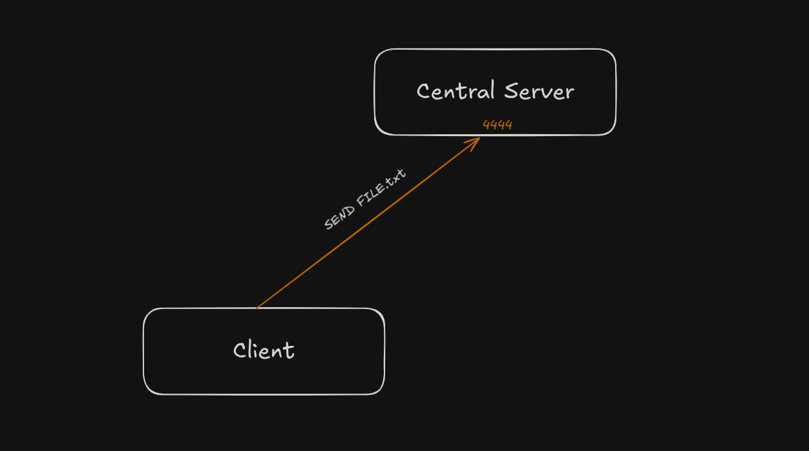
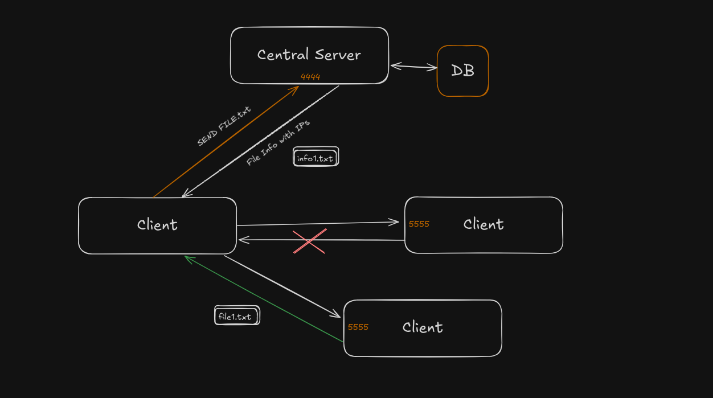

# sockets-in-c

## Simple server to client FTP

## Peer to Peer File Transfer with centralised control server

You are supposed to develop a peer to peer (P2P) file transfer program. The program
has two parts, of which first is the server program waiting for the connections from the client.
The Server should be waiting for connections in port number 4444, to which the client should
request for initiating a TCP connection. After establishing the connection successfully, the client
should be able to request for a file to the server. 

The client would be requesting the server to initiate files transfer by using the command “Send FILENAME”. On receiving the command, server will be checking for the presence of the file “FILENAME” in its database. Once the details of the file is found, the server would be sending the details of the client having the file along with their IP address.

The client would be establishing a new connection in port number 5555 with one of the client in the list and will again request for the fie and initiate transfer of the file. If the client fails to transfer the file successfully, then the connection would be setup to the next available client in the list, ad will reinitiate the file transfer. The connection with the client would be closed after completing the file transfer successfully.

If the client request for multiple files to server, one after the other “Send FILENAME1”, “Send FILENAME2”, “Send FILENAME3” or by command “Send FILENAME1, FILENAME2, FILENAME3” the server will be checking for the presence of each of the file filenames in its database. Once the details of the file is found, the server would be sending the details of the client having the file along with their IP address as separate file. Separate connections will be established with each of the client for downloading the file. Once all the files are transferred, the connection would be closed to respective peers (clients). The connection with the server won’t be terminated, and will be terminated only once the program is exited. You can initiate multiple separate parallel connections from the client to other clients (peers) to download the files requested.

Working : 

| seq | Server | Peer1 | Peer2 |
| --- | --- | --- | --- |
|  | Starts ./server and Listens on `4444` |  |  |
|  |  | Starts `./peer` , connect to server on `5556` and listen on `5555` |  |
|  |  | [5556] → Sends the server info for all files in folder `./files/` using UPDATE command from a new socket |  |
|  | Updates DB for file info |  |  |
|  |  |  | Starts `./peer` , connect to server on `5556` and listen on `5555` |
|  |  |  | Sends the server info for all files in folder `./files/` using UPDATE command from a new socket |
|  | Updates DB for file info |  |  |
|  |  | [5556] → SEND file1.txt, file2.md |  |
|  | Receives instruction from 4444, extracts list of filenames and check the **DB** |  |  |
|  | Send `info.txt` with info available IP list for each requested file where it is available |  |  |
|  |  | Process `info.txt` and create parallel socket connections to get the available files and print the unsuccessful attempts of file transfer and if file DNE etc error codes |  |
|  |  | persist listening on `5555` and server connection on `5556` |  |